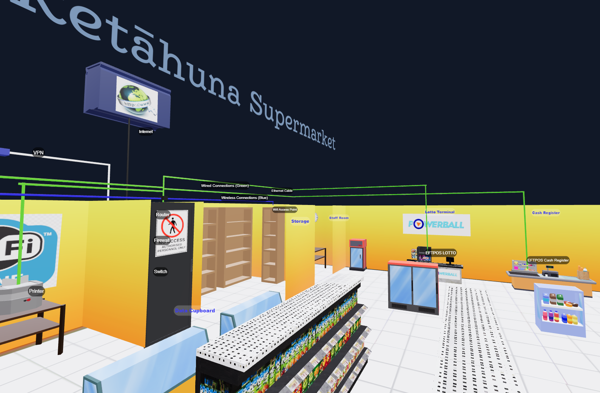

Supermarket Network Diagram Project

 🚀 Welcome to the Supermarket Network Diagram Project! This project was created as part of my course BIT503 Fundamentals of Information Technology on Open Polytechnic NZ 🥝 to fulfill the requirements for the Assessment N 2 Task 2: Networking concepts, part 1, creating a network diagram solution. Instead of a traditional diagram, I developed an interactive web page that accurately represents the network setup of a supermarket.🚀

 Open Polytechnic NZ
 New Zealand Diploma in Web Development and Design
 BIT503 Fundamentals of Information Technology
 Facilitator: Sandra Cleland

Project Overview
This project uses Astro, HTML, Tailwind CSS, JavaScript, Three.js, React, R3F and R3F Drei to create an interactive 3D model of a supermarket. The model is designed with BLENDER to demonstrate the application of networking concepts by visually representing the network components and their physical locations within the supermarket.

Features

🔥 3D Supermarket Model: A low poly model created using Blender, accurately depicting the supermarket floor plan.
🔥 Interactive Network Diagram: The model includes detailed network components, showing their physical locations and connections.
🔥 Wired and Wireless Connections: Demonstrates both types of connections within the network.
🔥 Labelled Components: Each network component is labeled with its IP address, gateway address, and physical location.
🔥 DHCP Services: Identifies the device providing DHCP services.
🔥 Firewall Protection: Shows the internet connection protected by a firewall, providing network services to all devices.
🔥 Live Demo
🔥 You can view the live project here: https://supermarket-assessment2-open-polythecnic.vercel.app/

Technologies Used
💻Astro: Static site generator for building fast, optimized websites.
💻HTML: Markup language for creating the structure of the web page.
💻Tailwind CSS: Utility-first CSS framework for styling the web page.
💻JavaScript: Programming language for interactive and dynamic elements.
💻Three.js: JavaScript library for creating 3D graphics in the web browser.
💻Blender: 3D modeling software used to create the supermarket model.

Installation
To run this project locally, follow these steps:

Clone the repository:

bash
Copy code
git clone https://github.com/JorgeGdev/Assessment2--Open-Polythecnic-Web-Development-Course
cd supermarket-network-diagram
Install dependencies:

bash
Copy code
npm install
Run the development server:

bash
Copy code
npm run dev
Open your browser and go to http://localhost:4321 to see the project.

Usage
Explore the 3D model to see the network components and their connections. Hover over the components to see their labels, including IP addresses and gateway information. The interactive elements demonstrate how the devices are connected in a physical topology.

Network Diagram Details
Question 1: Diagram Components
Contains all components: The model includes all the network components detailed in the scenario.
Groups items by location: Physical locations are shown using standard network diagram techniques.
Physical topology: Connections between network components are shown using wired and wireless connections.
Connection media: The correct media for connecting devices is identified using a key.
Firewall protection: The internet connection is protected by a firewall, providing network services to all devices and staff.
Question 2: Diagram Labels
Device labels: Each device is identified with a label.
IP addresses: All wired network devices are labeled with an appropriate IP address, including the router.
Gateway address: The gateway address is identified, and the device it is on is clearly indicated.
Physical locations: Physical locations are clearly labeled.
DHCP services: The device providing DHCP services is identified.
Contributing
If you would like to contribute to this project, please fork the repository and create a pull request with your changes. Contributions are always welcome!

Contact
If you have any questions or feedback, please feel free to contact me at hello@jorgegdev.com.

Enjoy exploring the Supermarket Network Diagram Project!